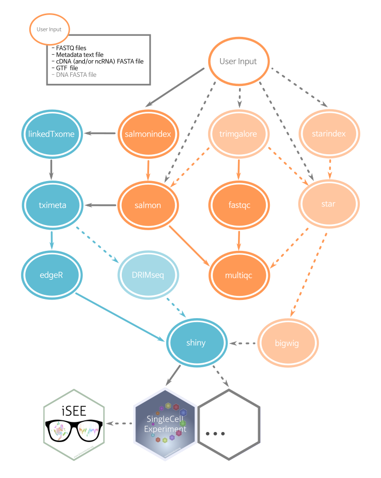

# ARMOR workflow

**ARMOR** (**A**utomated **R**eproducible **MO**dular **R**NA-seq) is a [Snakemake workflow](https://snakemake.readthedocs.io/en/stable/index.html), aimed at performing a typical RNA-seq workflow in a reproducible, automated, and partially contained manner. It is implemented such that alternative or similar analysis can be added or removed. 

ARMOR consists of a `Snakefile`, a [`conda`](https://conda.io/docs/) environment file (`envs/environment.yaml`) a configuration file (`config.yaml`) and a set of `R` scripts, to perform quality control, preprocessing and differential expression analysis of RNA-seq data. The output can be combined with the [`iSEE`](https://github.com/csoneson/iSEE) `R` package to generate a `shiny` application for browsing and sharing the results.  

By default, the pipeline performs all the steps shown in the [diagram](dag_nice3.png) below. However, you can turn off any combination of the light-colored steps (e.g `STAR` alignment or `DRIMSeq` analysis) in the `config.yaml` file. 

*Advanced use*: If you prefer other software to run one of the outlined steps (e.g. `DESeq2` over `edgeR`, or `kallisto` over `Salmon`), you can use the software of your preference provided you have your own script(s), and change some lines within the `Snakefile`. If you think your "custom rule" might be of use to a broader audience, let us know by opening an issue.

## Using the ARMOR workflow
To use the ARMOR workflow on your own data, follow the steps outlined in the [wiki](https://github.com/csoneson/rnaseqworkflow/wiki).

## Workflow graph
  
Blue circles are rules run in `R`, orange circles from software called as shell commands. Dashed lines and light-colored circles are optional rules, controlled in `config.yaml`

## Contributors
Current contributors include:

- [Ruizhu Huang](https://github.com/fionarhuang)
- [Katharina Hembach](https://github.com/khembach)
- [Stephany Orjuela](https://github.com/sorjuela)
- [Mark D. Robinson](https://github.com/markrobinsonuzh)
- [Charlotte Soneson](https://github.com/csoneson)
